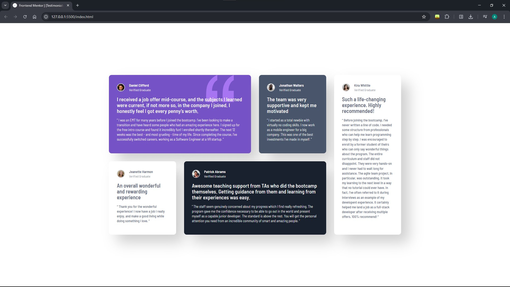
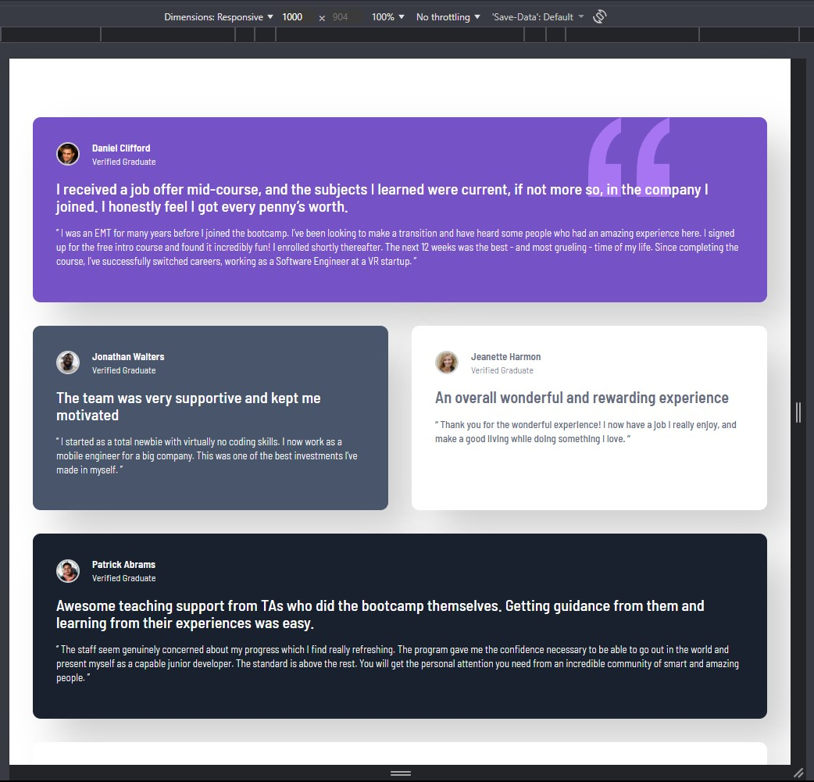
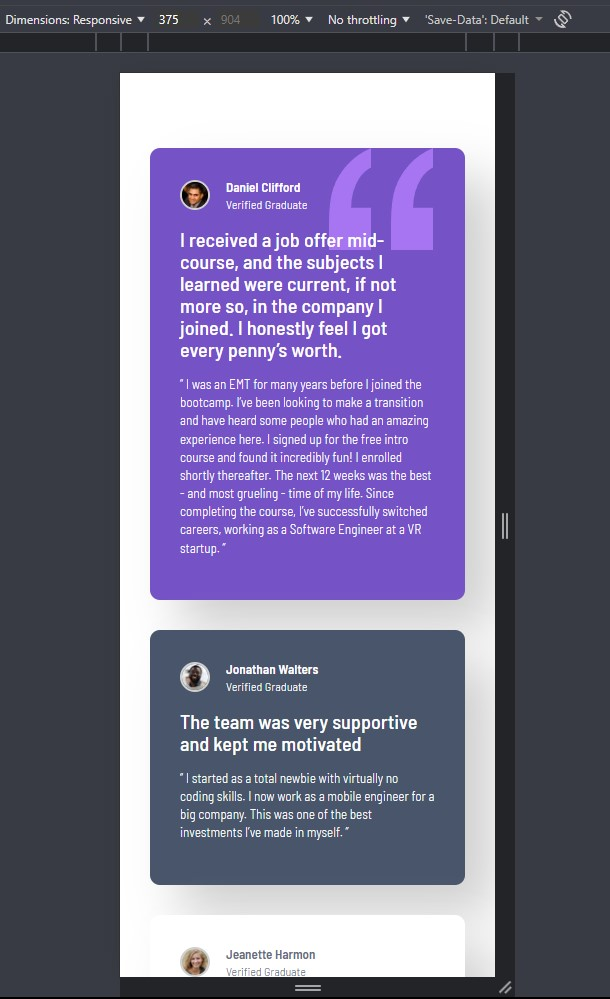

# Frontend Mentor - Testimonials grid section solution

This is a solution to the [Testimonials grid section challenge on Frontend Mentor](https://www.frontendmentor.io/challenges/testimonials-grid-section-Nnw6J7Un7).
Frontend Mentor challenges help improve coding skills by building realistic projects. 

## Table of contents

- [Overview](#overview)
  - [The challenge](#the-challenge)
  - [Screenshot](#screenshot)
  - [Links](#links)
- [My process](#my-process)
  - [Built with](#built-with)
  - [What I learned](#what-i-learned)
  - [Continued development](#continued-development)

## Overview

### The challenge

Users should be able to:

- View the optimal layout for the site depending on their device's screen size

### Screenshot

### Links

- Solution URL: [Github](https://github.com/y-c-y-k-a/Testimonials-Grid-Section)
- Live Site URL: [Github Pages](https://y-c-y-k-a.github.io/Testimonials-Grid-Section/)

## My process

### Built with

- Semantic HTML5 markup
- CSS custom properties
- Flexbox
- CSS Grid

### What I learned

Продолжаю изучение grid-layout. В ходе работы узнал, каким образом можно адаптировать grid под разные размеры окна. 

### Continued development

В дальнейшем планирую закреплять полученные по grid знания дальше.